# SLA Audit Engine: Destination of Funds Walkthrough

This document provides a comprehensive workflow diagram and a detailed step-by-step written walkthrough explaining how the **SLA Audit Engine** processes transaction sales data, maps it to pricing rules (incorporating the **Destination of Funds** dimension), performs calculations, and assigns compliance statuses.

---

## 1. Annotated Workflow Diagram

The flowchart below traces the complete pipeline of a transaction as it passes through the SLA Audit Engine:

```mermaid
graph TD
    %% Inputs
    CSV[Daily Sales CSV] -->|Upload & Column Map| Engine[SLA Audit Engine]
    XLS[SLA Master Excel] -->|Upload & Sheet Parsing| Engine
    
    %% Standardisation
    Engine -->|Step 1: Standardise & Clean| Std[Standardised Sales Data]
    Std -->|Lowercase Keys| MatchPrep[raw_cat_low, name_low, dest_fund_low]
    
    %% SLA Casing check
    MatchPrep -->|Step 1: Match SLA Columns| CheckDest{Does SLA Sheet contain<br/>'Destination of funds'?}
    
    %% Matching Logic
    CheckDest -->|Yes| Merge3[Merge on:<br/>Category + Name + Destination of Funds]
    CheckDest -->|No| Merge2[Fallback Merge on:<br/>Category + Name]
    
    %% Matching Result
    Merge3 --> MatchCheck{Was an SLA row<br/>successfully merged?}
    Merge2 --> MatchCheck
    
    %% Outcome assignment
    MatchCheck -->|Yes: Tier Match| EvaluateTier{Does active_val fall inside<br/>Min_Amt and Max_Amt?}
    MatchCheck -->|No| NoTier[Assign 'No Tier'<br/>Bootstraps pricing targets to 0]
    
    EvaluateTier -->|Yes| ApplySLA[Matched SLA pricing rule<br/>Inherits Target_Value & Limit_Value]
    EvaluateTier -->|No| NoTier
    
    %% Step 2: Expected Fee
    ApplySLA --> CalcExpected{Step 2: Expected Fee<br/>Is_Percentage == TRUE?}
    NoTier --> CalcFee0[Expected Fee = 0]
    
    CalcExpected -->|Yes| FeePct[Fee = min active_val * Target_Value, Limit_Value]
    CalcExpected -->|No| FeeFlat[Fee = Target_Value]
    
    %% Step 3: Aggregation
    FeePct --> GroupStep[Step 3: Weighted Grouping<br/>Segment + Cat + Client + Destination of Funds + Tier]
    FeeFlat --> GroupStep
    CalcFee0 --> GroupStep
    
    %% Aggregation outcomes
    GroupStep --> CalcRates[Compute Weighted Indicators:<br/>- SLA_Target: Total Expected / Total Value<br/>- Margin %: Total Revenue / Total Value<br/>- Var: Margin % - SLA_Target]
    
    %% Step 4: Status
    CalcRates --> CheckStatus{Step 4: Status Check<br/>Was it matched to 'No Tier'?}
    CheckStatus -->|Yes| StatusNoTarget[Status: No Target]
    CheckStatus -->|No| CheckTol{Does Var fall within<br/>variance tolerance slider?}
    
    CheckTol -->|Yes| StatusPass[Status: Pass ✅]
    CheckTol -->|No| StatusFail[Status: Fail ❌]
    
    %% Styling and layout
    style CSV fill:#38bdf8,stroke:#0369a1,stroke-width:2px,color:#0f172a
    style XLS fill:#10b981,stroke:#047857,stroke-width:2px,color:#0f172a
    style StatusPass fill:#d1fae5,stroke:#059669,stroke-width:2px,color:#065f46
    style StatusFail fill:#ffe4e6,stroke:#e11d48,stroke-width:2px,color:#9f1239
    style StatusNoTarget fill:#fef3c7,stroke:#d97706,stroke-width:2px,color:#92400e
```

---

## 2. Detailed Written Walkthrough

The SLA Audit Engine executes a structured **four-step pipeline** inside `src/engine.py` to audit transaction-level performance. Below is a detailed breakdown of how each step operates:

### ______________________________________________________________________
### Step 1: Tier Matching and Bootstrapping
For every sales transaction within a business segment, the engine first determines which SLA pricing rules and tier boundaries apply:
1. **Interactive Column Mapping**: The user selects which column from the raw CSV represents the **Destination of Funds** (auto-matching words like `destination`, `fund`, or `dest`).
2. **Double-Dimension Matching**:
   * The transaction's **Category**, **Name** (Client/Partner), and **Destination of Funds** are aligned against the corresponding columns in the uploaded SLA master sheet.
   * If a `Destination of Funds` column is present in the SLA sheet, matching is executed strictly across all three columns. If missing, it gracefully falls back to matching only on `Category` and `Name` for full backwards compatibility.
3. **Tier Boundary Evaluation**: The transaction amount (`active_val`) is evaluated against the matched rule's configured boundaries: `Min_Amt` and `Max_Amt`.

#### Outcome Determination
* **Tier Match**: If the transaction amount falls within a defined tier range, the transaction is mapped to that tier and inherits all configured SLA pricing parameters.
* **No Tier Match**: If the transaction amount does not fall within any configured tier (or if no matching record exists in the SLA sheet), it is classified as **“No Tier.”** A bootstrapping process automatically initializes all pricing-related fields (`Target_Value`, `Limit_Value`, and others) to `0` to prevent runtime calculation crashes.

### ______________________________________________________________________
### Step 2: Expected Fee Calculation (`expected_fee_ghc`)
Once the pricing parameters are successfully inherited or bootstrapped, the engine computes the expected fee at the individual row level:

* **A. Percentage-Based Fees with a Cap**
  When `Is_Percentage = TRUE`, the expected fee is calculated as a percentage of the transaction amount, subject to a maximum allowable cap (`Limit_Value`):
  $$\text{Expected Fee} = \min(\text{Transaction Value} \times \text{Target Value}, \text{Limit Value})$$

* **B. Flat Fees**
  When `Is_Percentage = FALSE`, the expected fee is assigned as a static flat fee:
  $$\text{Expected Fee} = \text{Target Value}$$

* **C. No Tier Transactions**
  For transactions categorized as “No Tier,” the expected fee is automatically assigned a value of `0`.

### ______________________________________________________________________
### Step 3: Weighted Rate Aggregation
Before performing the final compliance audit, individual rows are aggregated into weighted groups to evaluate blended, overall performance.

Grouping is performed based on:
1. **Business Segment**
2. **Category**
3. **Name (Client)**
4. **Destination of Funds**
5. **Tier Range**

The engine then computes the following weighted indicators for the group:
* **SLA Target (Expected Weighted Rate)**
  The expected blended pricing rate across grouped transactions:
  $$\text{SLA\_Target} = \frac{\sum \text{Expected Fees}}{\sum \text{Transaction Values}}$$

* **Margin % (Actual Charged Rate)**
  The actual effective rate charged based on generated revenue:
  $$\text{Margin \%} = \frac{\sum \text{Gross Revenue}}{\sum \text{Transaction Values}}$$

* **Variance (Var)**
  The variance measures the difference between your actual effective charged rate and the expected SLA rate:
  $$\text{Var} = \text{Margin \%} - \text{SLA\_Target}$$

### ______________________________________________________________________
### Step 4: Compliance Status Assignment
Finally, the engine compares the calculated variance against the user-defined sensitivity threshold (`tolerance`, e.g., 10%) configured in the UI sidebar:

* **No Target**
  Assigned when a transaction group falls under “No Tier,” meaning no SLA pricing rule was configured for these transactions.

* **Pass**
  A transaction group is marked as **Pass** when the absolute deviation between the actual charged rate and the SLA target remains within the permitted tolerance range:
  $$|\text{Margin \%} - \text{SLA\_Target}| \le (\text{SLA\_Target} \times \text{tolerance}) + 0.0001$$

* **Fail**
  A transaction group is marked as **Fail** when the actual charged rate exceeds the permitted tolerance threshold, indicating a pricing inconsistency or potential revenue leakage.
